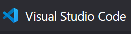
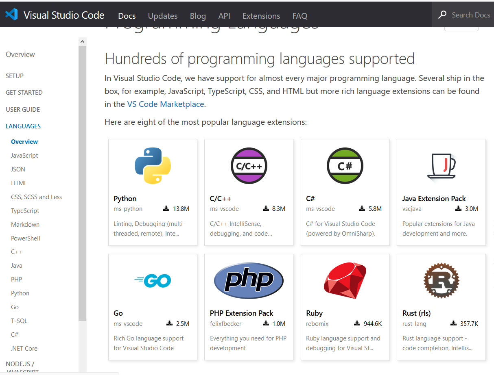
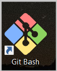
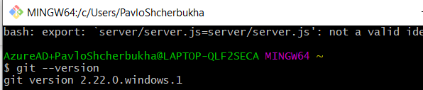
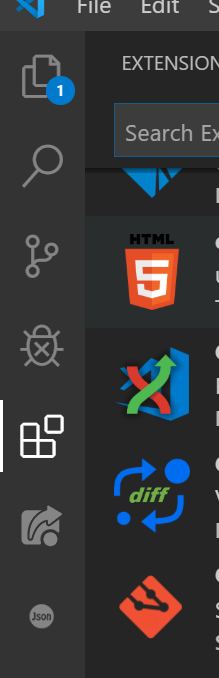
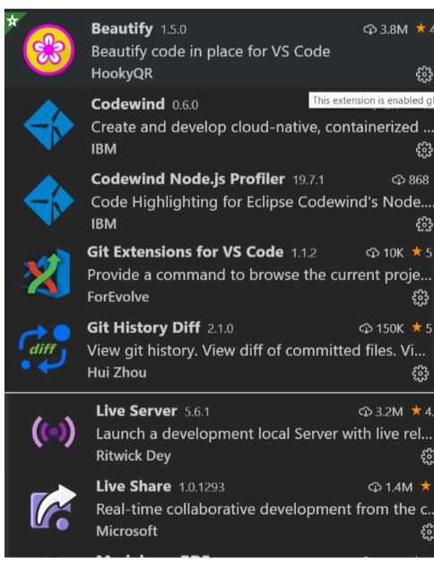
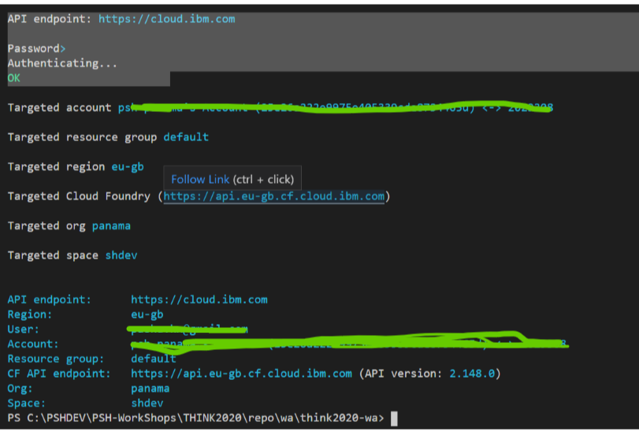
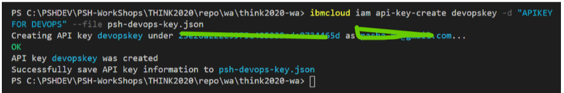
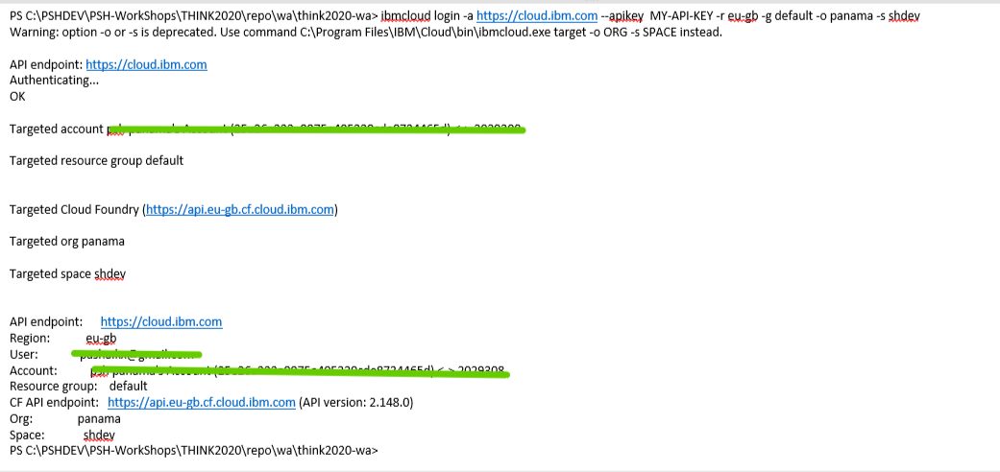
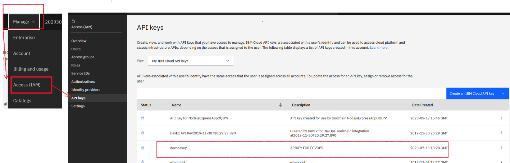

# LAB-0 - Встановлення програмного забезпечення


<!-- TOC BEGIN -->
- 1 [Вступ](#p1)

- 2 [Встановлення Node.js](#p2)

- 3 [Встановлення Visual Studio Code](#p3)

- 4 [Встановлення системи контролю версій GIT](#p4)

- 5 [Створення Git-Hub облікового запису](#p5)

- 6 [Встановлення Docker](#p6) 

- 7 [Встановлення IBM Cloud Command Line](#p7)

<!-- TOC END -->

<a name="p1"></a>
## Вступ

Документація написана з використанням загадльно-прийнятого формату markdown (файли  типу *.md). Короткий довідник по markdown знаходиться по лінку [markdown help](https://gist.github.com/MinhasKamal/7fdebb7c424d23149140).

Лабораторні роботи розраховані на роботу з OS windows-10


<a name="p2"></a>
## Встановлення Node.js

Скачати та встановити Node.js Latest LTS version [https://nodejs.org/en/download/](https://nodejs.org/en/download)
Перевірка результату встановлення:

```sh
npm -v
node -v
```

Результат повинен бути приблизно таким, або з вищою версією:

```sh
$ npm -v
6.14.18

$ node -v
v14.15.0
```

На сьогодні підтримуються [ Node.js runtimes](https://cloud.ibm.com/docs/cloud-foundry-public?topic=cloud-foundry-public-nodejs-latest_updates)

**v10.22.1, v10.23.0, v12.19.0, v12.19.1, v14.15.0, v14.15.1.**

<a name="p3"></a>
## Встановлення Visual Studio Code

<kbd></kbd>

Microsoft VS Code зараз використовується для багатьох інструментів. В нашому випадку будемо використовувати його для розробки наших app.
Скачати Visual Studio Code for Javascript development по лінку [https://code.visualstudio.com/download](https://code.visualstudio.com/download)

<kbd></kbd>


<a name="p4"></a>
## Встановлення системи контролю версій GIT

- Для Windows:
  Скачати і встановити по линку link [http://git-scm.com/download/win](http://git-scm.com/download/win)

- Перевірка

  Запустити git-bush  та виконати команду  
<kbp></kbp>

```sh
    git --version
```

<kbp></kbp>

<a name="p5"></a>
## Створення Git-hub облікового запису

Для цього потрібно зареєструватися по лінку: Register at [https://github.com](https://github.com)


## Встановлення плагінів до Visual Studio Code

Встановлення та видалення плагінів - важлива частина роботи з VSCode. На малюнку показано, де встановлювати плагіни
<kbd></kbd>

Встановити плагіни, назви яких показані на малюнку
<kbd></kbd>

<a name="p6"></a>
## Встановлення Docker  
(для цієї лабораторної не обов'язково, ала бажано для майбутніх)

 - Створити обліковий запис на [DockerHub](https://hub.docker.com/)

 - Встановити [DockerDesktop for Windows](https://hub.docker.com/?overlay=onboarding)


 <a name="p7"></a>
## Встановлення IBM Cloud Command Line  

**Інструкція по встановленню:** https://www.ibm.com/cloud/cli

**Документація на IBM CLI:** https://cloud.ibm.com/docs/cli?topic=cli-getting-started

[IBM Cloud CLI Quick Reference](https://cloud.ibm.com/media/docs/downloads/IBM%20Cloud%20CLI%20quick%20reference.pdf)

IBM Cloud CLI  перевірка

``` bash
  ibmcloud -vibm
```

У відповідь отримаємо щось таке:

```bash
  C:\Program Files\IBM\Cloud\bin\ibmcloud.exe version 1.3.0+4308925-2020-12-16T07:53:49+00:00
```  

``` bash

  ibmcloud -h

```

```bash
NAME:
  C:\Program Files\IBM\Cloud\bin\ibmcloud.exe - A command line tool to interact with IBM Cloud 
  Find more information at: https://ibm.biz/cli-docs

USAGE:
  [environment variables] C:\Program Files\IBM\Cloud\bin\ibmcloud.exe [global options] command 
[arguments...] [command options]

VERSION:
  1.3.0+4308925-2020-12-16T07:53:49+00:00

COMMANDS:
  api                                   Set or view target API endpoint
  login                                 Log user in
  target                                Set or view the targeted region, account, resource group, org or space
  config                                Write default values to the config
  update                                Update CLI to the latest version
  logout                                Log user out
  regions                               List all the regions
  version                               Print the version
  resource                              Manage resource groups and resources
  iam                                   Manage identities and access to resources
  dev                                   Create, develop, deploy, and monitor applications
  app                                   [Deprecated] Manage Cloud Foundry applications and application related domains and routes.
  service                               [Deprecated] Manage Cloud Foundry services.
  billing                               Retrieve usage and billing information
  plugin                                Manage plug-ins and plug-in repositories
  cf                                    Run Cloud Foundry CLI with IBM Cloud CLI context       
  catalog                               Manage catalog
  account                               Manage accounts, users, orgs and spaces
  enterprise                            Manage enterprise, account groups and accounts.
  cfee                                  [Deprecated] Manage Cloud Foundry Enterprise Environments
  cloud-functions, wsk, functions, fn   Manage Cloud Functions
  cr                                    Manage IBM Cloud Container Registry content and configuration.
  cs, ks                                Manage IBM Cloud Kubernetes Service clusters.
  sdk                                   An IBM Cloud command line plugin to generate an SDK from an OpenAPI
                                              specification document or to validate an OpenAPI 
spec
  sl                                    Manage Classic infrastructure services
  help, h                               Show help

Enter 'C:\Program Files\IBM\Cloud\bin\ibmcloud.exe help [command]' for more information about a command.

ENVIRONMENT VARIABLES:
  IBMCLOUD_COLOR=false                     Do not colorize output
  IBMCLOUD_VERSION_CHECK=false             Do not check latest version for update
  IBMCLOUD_HTTP_TIMEOUT=5                  A time limit for HTTP requests
  IBMCLOUD_API_KEY=api_key_value           API Key used for login
  IBMCLOUD_TRACE=true                      Print API request diagnostics to stdout
  IBMCLOUD_TRACE=path/to/trace.log         Append API request diagnostics to a log file        
  IBMCLOUD_HOME=path/to/dir                Path to config directory

GLOBAL OPTIONS:
  --version, -v                      Print the version
  --help, -h                         Show help

```

Чому важливо вміти працювати з IBM CLI? 
CLI може широко використовуватися в DEVOPS 
CLI можна запускати з локальної станції
CLI можна запкускати Cloud shell

Зайти в під своїм обліковим записов можна двома шляхами:

- використовуючи логін та пароль
Підходить для разових операцій. 
Не підходить для використаня в devops

Для цього використовуємо команду: **ibmcloud login**

```bash

ibmcloud login -a <API endpoint> -u <user mail> -p <user password> -r <region> -g <resource group> -o <cloudfoundry organisation> -s <space>

```
* -a API endpoint вказуємо https://cloud.ibm.com
* -u user mail  вказуємо e-mail  з яким користувач заходить в IBM Cloud dashboard
* -p user password вказується пароль користувача, з яким  заходить в IBM Cloud dashboard 
* -r region вказується регіон, в якому будуть разгортатися  (уже розгорнуті) сервіси
* -g resource group вказується група ресурсів. За замовчуванням має ім'я default
* -o cloudfoundry organisation 
* -s space in cloudfoundry organisation

Реквізити: region, resource group, cloudfoundry organisation, space можна отримати з аблиці відображення ресурсів (pic-6)
<kbd></kbd>
<p style="text-align: center;">pic-6</p>

Або ж, зайти в свій account в меню: "Manage/Account/Cloud Foundry Orgs" (pic-7)

<kbd></kbd>
<p style="text-align: center;">pic-7</p>


Приклад команди:

```bash

 ibmcloud login -a https://cloud.ibm.com -u zzzz@gmail.com -r eu-gb -g default -o panama -s shdev

```
Результат виконання команди показаний на pic-8
<kbd></kbd>
<p style="text-align: center;">pic-8</p>


- використовуючи API KEY
Підходить для використання в devops  так і для персонального вкористання.
Для цього створимо API-KEY

```bash
ibmcloud iam api-key-create NAME [-d DESCRIPTION] [--file FILE] [--lock] 
```

* NAME (required)
    Найменування API key, який буде створено.
* -d DESCRIPTION (опціонально, але краще внести, щоб потім розуміти для чого)
    Опис API-KEY.
* --file FILE
    Зберегти інформацію про API key  у заданий файл на laptop.
* --lock
    Заблокувати API key коли він буде створений.

Приклад:
Create an API key and save to a file:

```bash
ibmcloud iam api-key-create MyKey -d "this is my API key" --file key_file
```
Файл **key_file** являє собою JSON.

Таким чином згерований API-KEY  в локальний файл и будемо його використовувати в подальших операціях. Генеруємо, виконавши  команду:

```bash
ibmcloud iam api-key-create devopskey -d "APIKEY FOR DEVOPS" --file psh-devops-key.json 

```

Результат роботи команди показаний на pic-4 и в файле **psh-devops-key.json**

<kbd></kbd>
<p style="text-align: center;">pic-9</p>

Тепер модифікуємо команду логіну для використання в ній API-KEY.
API  выбирается из полученного JSON-файла, поле: **"apikey"**

```bash
 ibmcloud login -a https://cloud.ibm.com --apikey yourApiKey -r eu-gb -g default -o panama -s shdev
```

Результат роботи команди показаний на pic-10.

<kbd></kbd>
<p style="text-align: center;">pic-10</p>

Список сгенерованbх API-KEYs можна побачити в своєму account: Manage/Access IAM/API keys.
<kbd></kbd>
<p style="text-align: center;">pic-11</p>
