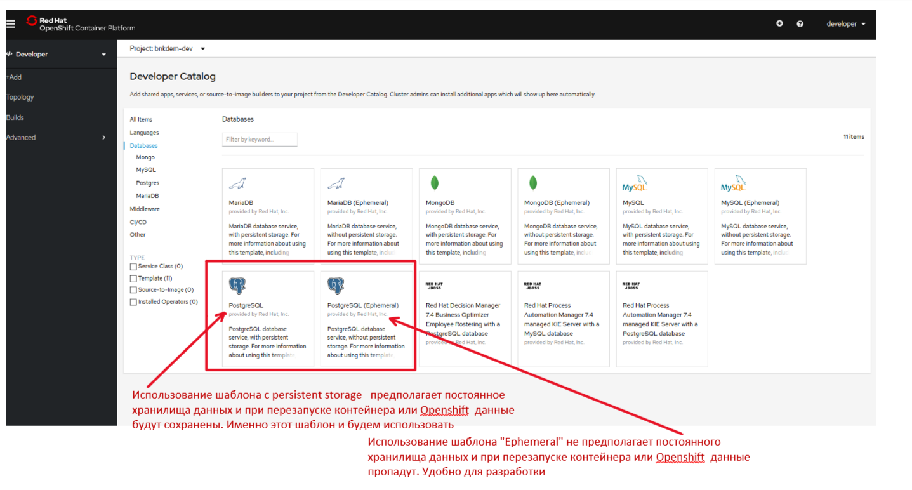
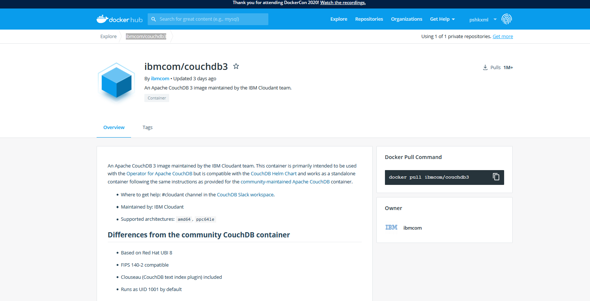
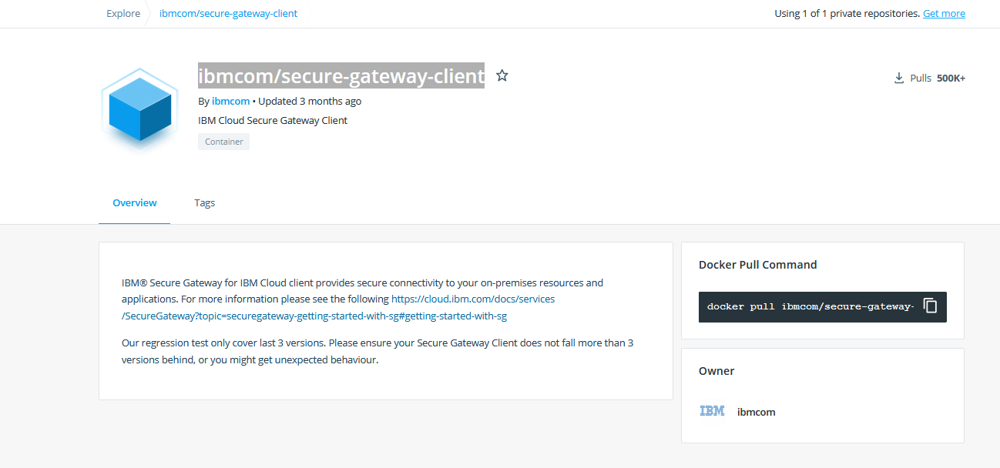
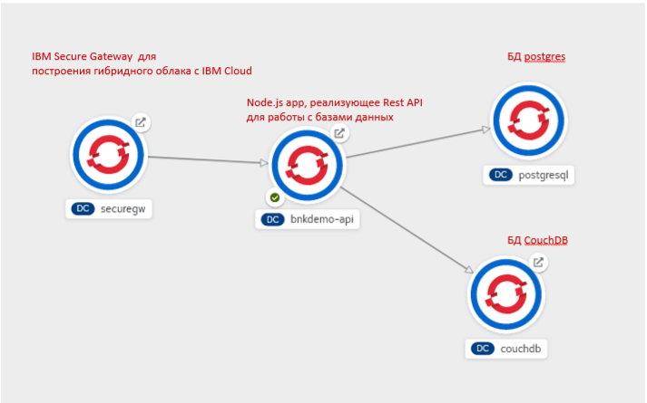
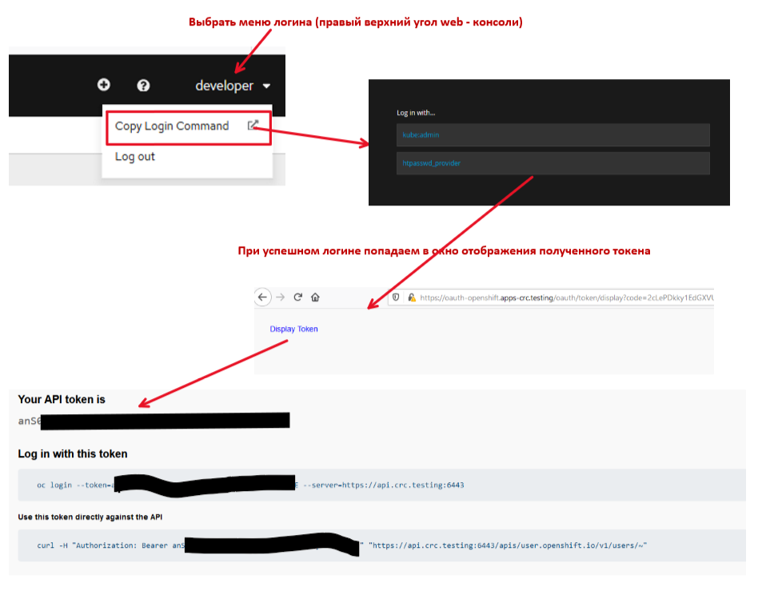
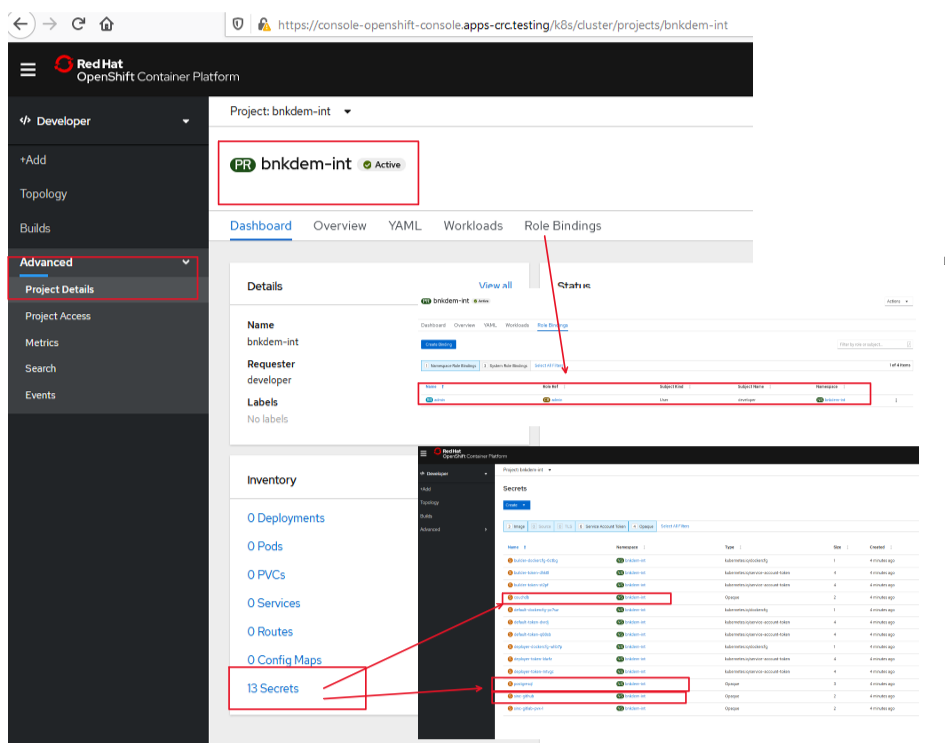
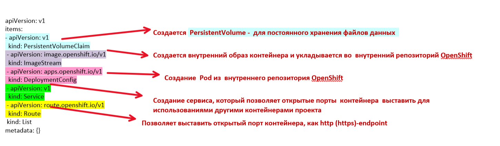
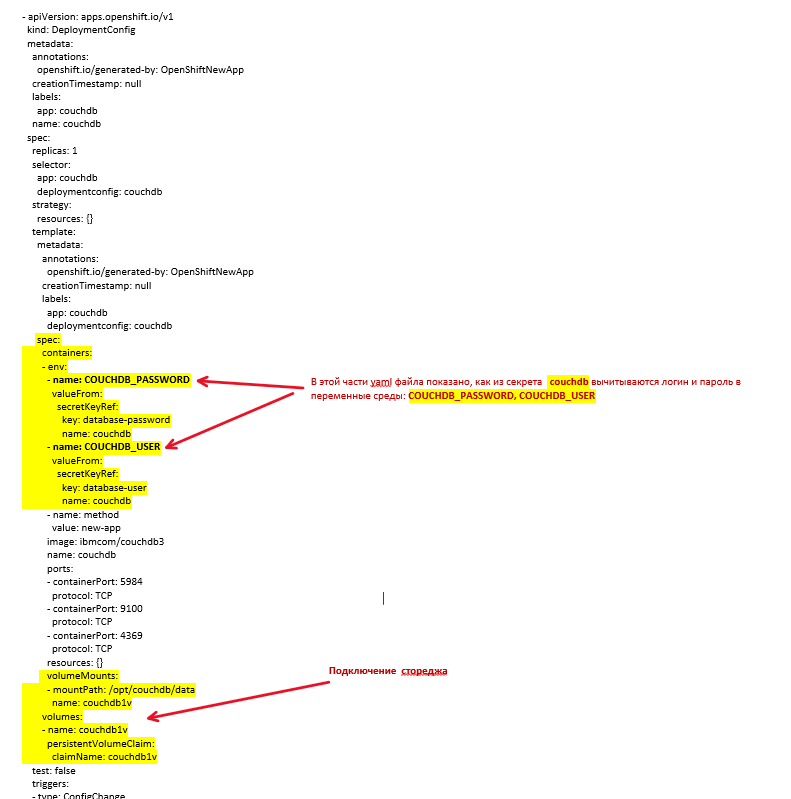

# bnkapi - Построение multicloud  CloudNative приложений на платформе OpenShift. Развертывание проекта в OpenShift

<!-- TOC BEGIN -->
- 1. [Цель работы](#p1)
- 2. [Выполнение лабораторной работы](#p2)
- 2.1. [Созадть проект в openshift: настройка  переменных](#p2-1)
- 2.2. [Созадть проект в openshift: Запуск скрипта на выполнение](#p2-2)
- 2.3. [Удалить проект в openshift: Запуск скрипта на выполнение](#p2-3)
- 2.4. [Созадть прикладные компоненты проект в openshift: назначение файлов](#p2-4)
- 2.5. [Созадть прикладные компоненты проект в openshift: настройка переменных](#p2-5)
- 2.6. [Созадть прикладные компоненты проект в openshift: Запуск deployemnt прикладных компонентов](#p2-6)
- 2.7. [Созадть прикладные компоненты проект в openshift: Создание схемы в БД postgres](#p2-7)

<!-- TOC END -->

<a name="p1"></a>
## Цель работы

Целью даной работы является демонстрация  возможностей развертывания многокомпонентных приложений на платформе OpenShift.

В лабораторой работе будут выполнены такие этапы:

- создание проекта и его подготовка для deployment в него многокомпонентных приложений с помощью oc cli.

 - deployment  реляционной базы данных postgres с  предустановленного каталога шаблонов, который присутствует в openshift с помощью oc cli, pic-1.
<kbd></kbd>
<p style="text-align: center;">pic-1</p>

 - deployment  NoSql  базы данных CouchDB (известная в IBM Cloud как CloudantDB) с  Docker репозитория и назначения ей Persistence storage.
 [ibmcom/couchdb3](https://hub.docker.com/r/ibmcom/couchdb3) pic-2.

<kbd></kbd>
<p style="text-align: center;">pic-2</p>

- deployment Rest API разработанного на базе Node.js express из исходного кода, размещенного в GitHub.

- deployemnt клиентской части IBM Secure Gateway с Docker репозитория как контейнер [ibmcom/secure-gateway-client](https://hub.docker.com/r/ibmcom/secure-gateway-client).

<kbd></kbd>
<p style="text-align: center;">pic-3</p>

В результате выполнения работы будет построена топология компонентов приложения, показанная на pic-4

<kbd></kbd>
<p style="text-align: center;">pic-4</p>

<a name="p2"></a>
## Выполнение лабораторной работы

<a name="p2-1"></a>
###  Создать проект в openshift: настройка  переменных

В корне каталога ./openshift  находится набор .cmd файлов  для создания проекта. Основная цель этого пакета файлов - создать проекты в зависимости от среды и создать дополнительны  сущности, которые называются **"secrets"**,  для автоматического подключения к gitHub-репозиториям, хранения параметров подключения к базам данных. Ниже - перечень этих файлов с пояснениями

- prj_env.cmd
Содержит настройку на проекты и  в openshift для разных сред.
Предполагается что может быть 3  проекта, в зависимости от сред:
Имя проекта для разных сред состоит из непосредственно имени и суффикса, обозначающего идентификатор среды.

Для нашего случая название проекта: **"bnkdem"**,  а суффиксы  берться из таблицы. Таким образм в зависимости от переданного параметра среды будут создаваться названия проектов как в колонке 3.

идентификатор среды | Наименование  среды  |  Названия проектов
:------------------ | -------------------: | -------------------:
dev                 | Среда разработки     |   bnkdem-dev
int                 | Среда тестирования   |   bnkdem-int
prod                | Среда продуктивная   |   bnkdem-prod

Фрагмент файла, где формируется имя проекта показан нижне
```bash

set BUILD_ENV=%1

echo SET Project parameters

   set PRJ-NAME=bnkdem
   set PRJ-DISP=bnkdem
   set PRJ-DESCR=bnkdem
echo SET ENV marker
   set PRJ-NAME=%PRJ-NAME%-%BUILD_ENV%
   set PRJ-DISP=%PRJ-DISP%-%BUILD_ENV%
   set PRJ-DESCR=%PRJ-DESCR%-%BUILD_ENV%
```

- login.cmd

Файл описыаающий логи с openshift кластер.
в даном случае используется команда:

```bash
        oc login
```

Можно залогинится по логину и паролю, а лучше по токену

```bash
oc login --your token --server=your-claster-api-url

```

На pic-5 показано, как получить  логин с токеном

<kbd></kbd>
<p style="text-align: center;">pic-5</p>

- crt_prj_opshift.cmd
Выполняет пакетное создание проекта и всех секретов. Приложения создаются в отдельном пакете файлов, в зависимости от среды.


- del_prj_opshift.cmd  
Выполняет пакетное удаление проекта и всех его приложений

- grn_prj_opshift.cmd
Дать права на проект другим разработчикам

- rev_prj_opshift.cmd
забрать права на проект

- crt_prj_secret.cmd
Создать сикреты внутри проекта. Ниже в квадратных скобках указано [какие реквизиты для подключения к gitHub] нужно внести  

```bash
        echo ****************************************
        echo *    create secret to gitLab
        echo *
        echo ****************************************

        oc create secret generic sinc-gitlab-pvx-1 --from-literal=username=[your gitlab login] --from-literal=password=[your gitlab password]

        oc secrets link deployer sinc-gitlab-pvx-1  
        oc secrets link builder sinc-gitlab-pvx-1

        oc annotate secret sinc-gitlab-pvx-1 "build.openshift.io/source-secret-match-uri-1=[your gitlab login uri https://github.com/[you login] ]
```
В данном случае  создание секрета к github выполняется полностью набором команд oc.
Дальше необходимо создать секреты для подключения к базам данных. Поэтому используется другой, универсальный механизм создания объектов в openshift  с использованием конфигурационного *.yaml файла.

```bash

        echo ****************************************
        echo *    create secret to couchDB
        echo *
        echo ****************************************
        oc create -f couchdb-secret.yaml

        echo ****************************************
        echo *    create secret to postgresDB
        echo *
        echo ****************************************
        oc create -f postgresdb-secret.yaml

```

- couchdb-secret.yaml  
Создание  секрета для  couchDB.
Необходимо внести логин и пароль пользователя для подключения к couchDB

```yaml
  stringData:
    database-password: [password]
    database-user: [login]
```

- postgresdb-secret.yaml
Создание  секрета для  postgres DB.

```yaml

  stringData:
    database-name: [database name]
    database-password: [password]
    database-user: [login]
```
<a name="p2-2"></a>
###  Созадть проект в openshift: Запуск скрипта на выполнение

Для создания проетка на среде int нужно запустить  указанный ниже команндный файл

```bash
        crt_prj_opshift.cmd int

```

В результате создания сгенерируется такой лог:

```text
C:\PSHDEV\PSH-WorkShops\THINK2020\repo\wa\think2020-bnkapi\openshift>crt_prj_opshift.cmd int
Active code page: 65001
**************************************************************
*            CREATE PROJECT ON OPENSHIFT
**************************************************************
set project and login
============================================================================
SET  Evironment variables for project
============================================================================
SET Project parameters
SET ENV marker
PRJ-NAME=bnkdem-int
PRJ-DISP=bnkdem-int
PRJ-DESCR=bnkdem-int
**************************************************************
*            Login script on OPENSHIFT
**************************************************************
* oc login --server --token=
* oc login --server -u  -p
**************************************************************
*************************************************************
* Openshift CLI URL=
*************************************************************
Logged into "https://api.crc.testing:6443" as "developer" using the token provided.

You have access to the following projects and can switch between them with 'oc project <projectname>':

  * bnk-dev
    bnkdem-dev
    bnkdem-prod

Using project "bnk-dev".
create project
Now using project "bnkdem-int" on server "https://api.crc.testing:6443".

You can add applications to this project with the 'new-app' command. For example, try:

    oc new-app ruby~https://github.com/sclorg/ruby-ex.git

to build a new example application in Python. Or use kubectl to deploy a simple Kubernetes application:

    kubectl create deployment hello-node --image=gcr.io/hello-minikube-zero-install/hello-node

NAME          DISPLAY NAME   STATUS
bnk-dev                      Active
bnkdem-dev    bnkdem-dev     Active
bnkdem-prod   bnkdem-prod    Active
Already on project "bnkdem-int" on server "https://api.crc.testing:6443".
************************************
*  create secrets
************************************
****************************************
*    create secret to  git
*
****************************************
secret/sinc-gitlab-pvx-1 created
secret/sinc-gitlab-pvx-1 annotated
secret/sinc-github created
secret/sinc-github annotated
****************************************
*    create secret to couchDB
*
****************************************
secret/couchdb created
****************************************
*    create secret to postgresDB
*
****************************************
secret/postgresql created
************************************
*  grant access to developers
************************************
****************************************
* Прдоставить другому разработчику права администратора проекта
*
****************************************
C:\PSHDEV\PSH-WorkShops\THINK2020\repo\wa\think2020-bnkapi\openshift>

```
<a name="p2-3"></a>
###  Удалить проект в openshift: Запуск скрипта на выполнение
Для удаления проетка на среде int нужно запустить  указанный ниже команндный файл

```bash
        crt_prj_opshift.cmd int

```

Ниже показан лог раобты комнады удаления

```text
C:\PSHDEV\PSH-WorkShops\THINK2020\repo\wa\think2020-bnkapi\openshift>del_prj_opshift.cmd int
Active code page: 65001
**************************************************************
*            DELETE PROJECT ON OPENSHIFT
**************************************************************
set project and login
============================================================================
SET  Evironment variables for project
============================================================================
SET Project parameters
SET ENV marker
PRJ-NAME=bnkdem-int
PRJ-DISP=bnkdem-int
PRJ-DESCR=bnkdem-int
**************************************************************
*            Login script on OPENSHIFT
**************************************************************
* oc login --server --token=
* oc login --server -u  -p
**************************************************************
*************************************************************
* Openshift CLI URL=
*************************************************************
Logged into "https://api.crc.testing:6443" as "developer" using the token provided.

You have access to the following projects and can switch between them with 'oc project <projectname>':

    bnk-dev
    bnkdem-dev
  * bnkdem-int
    bnkdem-prod

Using project "bnkdem-int".
project.project.openshift.io "bnkdem-int" deleted
NAME          DISPLAY NAME   STATUS
bnk-dev                      Active
bnkdem-dev    bnkdem-dev     Active
bnkdem-int    bnkdem-int     Terminating
bnkdem-prod   bnkdem-prod    Active

C:\PSHDEV\PSH-WorkShops\THINK2020\repo\wa\think2020-bnkapi\openshift>

```

Зайдя в web-console openshift можем проверить результаты создания проекта (pic-6)

<kbd></kbd>
<p style="text-align: center;">pic-6</p>


<a name="p2-4"></a>
###  Созадть прикладные компоненты проект в openshift: назначение файлов

В зависимости от среды в подкаталогах:

```text
    ./dev
    ./int
    .prod
```

находится набор пакетных файлов и настроек переменных среды для создания прикладных компонентов проекта, индивидуальных для каждой среды. В каждом каталоге находится одинаковый набор файлов. Разница может быть в настройках переменных среды.

- crt_app.cmd
Общий скрипт для последовательного пакетного создания всех прикладных компонентов

- 1-crt_app.cmd
Создать один компонент, который передается в виде параметра.

- crt_app_couchdb.cmd, crt_app_couchdb.yaml
Командный файл создания couchDB  из docker-контейнерного. Файл crt_app_couchdb.yaml - содержит описание компонентов, которые будут созданы в процессе выполнения.  На pic-7 показаны блоки yaml-файла с пояснениями выполняемых функций

<kbd></kbd>
<p style="text-align: center;">pic-7</p>

А на pic-8 показаны фрагменты, показывающие подключение стореджа и переменных серды.

<kbd></kbd>
<p style="text-align: center;">pic-8</p>


- crt_app_pgdb.cmd crt_app_pgdb.yaml
Командный файл дя создания postgres DB. Фай crt_app_pgdb.yaml  содержит описание компонентов, которые будут созданы в процессе выполнения.

- crt_app_bnkdemo-api.cmd, bnkdemo-api.env
Командный файл, для создания Node.JS  приложения реализующее REST API для работы с базами данных. Файл bnkdemo-api.env содержит перечень переменных среды, которые будут установлены в процессе развертывания.

Тут приложение создается командой **oc new-app**

```text
oc new-app https://github.com/pavlo-shcherbukha/bnkapidemo.git#master --context-dir=/src/bnkdemo-be  --name="bnkdemo-api" --env-file ./bnkdemo-api.env --strategy=source --source-secret=sinc-github --image-stream=openshift/nodejs:10-SCL -l app=bnkdemo-api

```

При этом параметризуется:
URL github репозитория, с которого будт доставаться исходники Node.js, через знак **"#"** указывается имя git branch

Относительная папка, с котроый взять исходники, указывается в ключе --context-dir
```
    --context-dir=/src/
```     

Ключ **--env-file** ссылкается на файл с переменными среды, которые будут созданы в процессе deployment

```text
   --env-file ./bnkdemo-api.env
```

Ключ **--strategy=source** уточняет, что развертывание приложения будет выполнено из репозитория исходного кода, а не из docker образа

Ключ --source-secret=sinc-github  указывает на секрет с параметрами подключения к github  для клонирования репозитория.

Ключ --image-stream=openshift/nodejs:10-SCL указывает на базовый образ, в который будут копироваться исходники и потом собираться итоговый образ приложения.

По линку [Container images offer lightweight and self-contained software to enable deployment at scale.](https://catalog.redhat.com/software/containers/search) можно найти документацию  и описание использования контейнеров. В даном случае, так как используется однопользовательская версия испльзуется образ: https://github.com/nodeshift/centos7-s2i-nodejs


После создания самого компонента  следует следующая команда, по созданию http - роутера, чтобы копонент стал доступным снаружи проекта.

```text
echo ****************************************
echo *    create bnkdemo-api Router
echo *
echo ****************************************
oc expose svc/bnkdemo-api --hostname="bnkapi-bnkdem-dev.apps-crc.testing" --name="bnkapi-bnkdem-dev.apps-crc.testing" --port 8080 -l app=bnkdemo-api
```

В даном случае, хочется обратить внимание, что --hostname состоит из вполне определенных реквизитов:
"bnkapi-bnkdem-dev.apps-crc.testing"
- .apps-crc.testing DNS кластера
- bnkdem-dev наименование проекта
- bnkapi наименование компонента в проекте.

следуя этим правилам, можно обеспечить неповторяемость роутеров.

- crt_app_securegw.cmd securegw.env

Создание клиентской части (не облачной) IBM Secure GateWay.

a name="p2-5"></a>
###  Создать прикладные компоненты проект в openshift: настройка переменных

Необходимо указанть URL DNS openshift кластера в файлах:
- crt_app_bnkdemo-api.cmd

- crt_app_securegw.cmd

- crt_app_couchdb.yaml  в разделе Route

```text

  kind: Route
  metadata:
    creationTimestamp: null
    labels:
      app: couchdb
    name: db-bnkdem-dev.apps-crc.testing
  spec:
    host: db-db-bnkdem-dev.apps-crc.testing
```

Указать параметры подклчения к базам данных в файле: bnkdemo-api.env.  


<a name="p2-6"></a>
###  Создать прикладные компоненты проект в openshift: Запуск deployemnt прикладных компонентов

Для запуска deployment  нужно запусить набор пакетных файлов с указанием среды deployment

```bash
  cd int
  crt_app.cmd int


```

Лог создания приложений показан ниже

```text

C:\PSHDEV\PSH-WorkShops\THINK2020\repo\wa\think2020-bnkapi\openshift>cd int

C:\PSHDEV\PSH-WorkShops\THINK2020\repo\wa\think2020-bnkapi\openshift\int>crt_app.cmd int
**************************************************************
*            CREATE APP IN OPENSHIFT
**************************************************************
set project and login
============================================================================
SET  Evironment variables for project
============================================================================
SET Project parameters
SET ENV marker
PRJ-NAME=bnkdem-int
PRJ-DISP=bnkdem-int
PRJ-DESCR=bnkdem-int
**************************************************************
*            Login script on OPENSHIFT
**************************************************************
* oc login --server --token=
* oc login --server -u  -p
**************************************************************
*************************************************************
* Openshift CLI URL=
*************************************************************
Logged into "https://api.crc.testing:6443" as "developer" using the token provided.

You have access to the following projects and can switch between them with 'oc project <projectname>':

    bnk-dev
    bnkdem-dev
  * bnkdem-int
    bnkdem-prod

Using project "bnkdem-int".
Already on project "bnkdem-int" on server "https://api.crc.testing:6443".
****************************************
*    create CouchDB
*
*    ./couchdb.env  - contains database admin and password
*    docker pull ibmcom/couchdb3
*    https://hub.docker.com/r/ibmcom/couchdb3
*    иммитация --output=yaml --dry-run
****************************************
No resources found
persistentvolumeclaim/couchdb1v created
imagestream.image.openshift.io/couchdb created
deploymentconfig.apps.openshift.io/couchdb created
service/couchdb created
route.route.openshift.io/db-bnkdem-dev.apps-crc.testing created
****************************************
*    create Postgres DB from template
*
****************************************
No resources found
service/postgresql created
persistentvolumeclaim/postgresql created
deploymentconfig.apps.openshift.io/postgresql created
****************************************
*    Router не нуже БД работает по своему протоколу
*    Нужно сделать port forward для работы с psql
*    oc port-forward postgresql-1-97dtc 15432:5432
*
****************************************
****************************************
*    create bnkdemo-api
*
****************************************
No resources found
warning: Cannot check if git requires authentication.
--> Found image 4b4fcd7 (5 months old) in image stream "openshift/nodejs" under tag "10-SCL" for "openshift/nodejs:10-SCL"

    Node.js 10
    ----------
    Node.js 10 available as container is a base platform for building and running various Node.js 10 applications and frameworks. Node.js is a platform built on Chrome's JavaScript runtime for easily building fast, scalable network applications. Node.js uses an event-driven, non-blocking I/O model that makes it lightweight and efficient, perfect for data-intensive real-time applications that run across distributed devices.

    Tags: builder, nodejs, nodejs10

    * The source repository appears to match: nodejs
    * A source build using source code from https://github.com/pavlo-shcherbukha/bnkapidemo.git#master will be created
      * The resulting image will be pushed to image stream tag "bnkdemo-api:latest"
      * Use 'oc start-build' to trigger a new build
      * WARNING: this source repository may require credentials.
                 Create a secret with your git credentials and use 'oc set build-secret' to assign it to the build config.
    * This image will be deployed in deployment config "bnkdemo-api"
    * Port 8080/tcp will be load balanced by service "bnkdemo-api"
      * Other containers can access this service through the hostname "bnkdemo-api"

--> Creating resources with label app=bnkdemo-api ...
    imagestream.image.openshift.io "bnkdemo-api" created
    buildconfig.build.openshift.io "bnkdemo-api" created
    deploymentconfig.apps.openshift.io "bnkdemo-api" created
    service "bnkdemo-api" created
--> Success
    Build scheduled, use 'oc logs -f bc/bnkdemo-api' to track its progress.
    Application is not exposed. You can expose services to the outside world by executing one or more of the commands below:
     'oc expose svc/bnkdemo-api'
    Run 'oc status' to view your app.
****************************************
*    create bnkdemo-api Router
*
****************************************
route.route.openshift.io/bnkapi-bnkdem-dev.apps-crc.testing exposed
Press any key to continue . . .

C:\PSHDEV\PSH-WorkShops\THINK2020\repo\wa\think2020-bnkapi\openshift\int>
```

<a name="p2-7"></a>
## Созадть прикладные компоненты проект в openshift: Создание схемы в БД postgres

Инструкция по запуску на выполнение DDL-скриптов находится в файле [src/ddl-bnk/readme.md](../src/ddl-bnk/readme.md)
